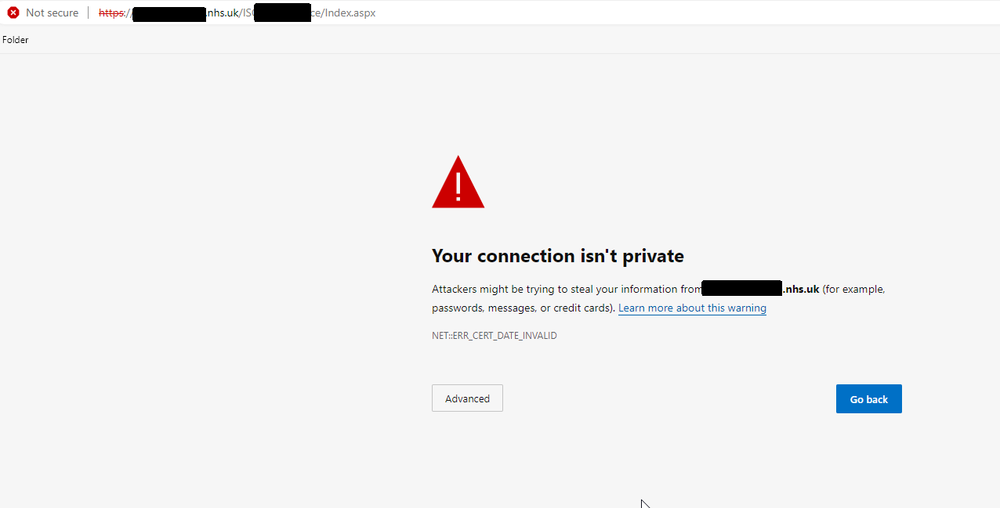

# Certificate authority principles in Dorset ICS 

## Summary

All organisations within the Dorset ICS rely on certificate authority functions to issue and manage security certificates which assure the security of internal and external web applications. Organisations will generally run their own certificate authority infrastructure (known as the _internal CA_) to this end, and endpoint devices within the scope of that organisation's management will generally trust certificates that have been issued by the internal CA. 

Endpoint devices outside of the scope of that organisation's management will not by default trust certificates issued by the internal CA, although they can be configured to do so.

Organisations may also procure and deploy certificates from external certificate authorities. While these have a cost attached they are often universally accepted by endpoints without the need for prior configuration.

## Problem

Where a _hosting organisation_ deploys an application using certificates issued by their internal CA, computers managed by other organisations (let us call these the _client organisations_) will not by default trust these certificates. This creates a problem whereby a certificate error is displayed to persons in the client organisations who visit the site:

It is often possible to accept the invalid certificate and bypass this warning, this will usually create a "not secure" flag in the web browser address bar:

As IT service providers, we should not ordinarily advise our customers to bypass such warnings: it both normalises bad practice and provides a poor level of assurance to both staff and patients that we are appropriately securing the systems for which we are responsible.

A more acceptable resolution is for the hosting organisation to make available the *CA certificate* of its internal CA to the client organisation. The client organisation then imports the CA certificate into its own internal CA infrastructure and makes this available to endpoint devices within the scope of its management - these devices will then trust certificates issued by the hosting organisation.

An alternative acceptable resolution is for the hosting organisation to deploy a certificate issued by a reputable external certificate authority. This will usually mean that the endpoint devices of any organisation will trust the certificate without any further configuration being required.

## Proposal

The proposal of this RFC is that organisations within the ICS discuss and agree a draft set of principles around the use of security certificates:

* that organisations undertake to issue certificates from an external certificate authority where this is feasible;
* that where hosting organisations continue to use internally issued certificates they make their CA certificate available to partner organisations, potentially via a shared secure website;
* that client organisations import and renew the CA certificates of hosting organisations as required, and proactively manage the lifecycle of the certificates they hold to ensure security certificates remain valid;
* that all organisations undertake to advise staff to not by default accept untrusted security certificates.